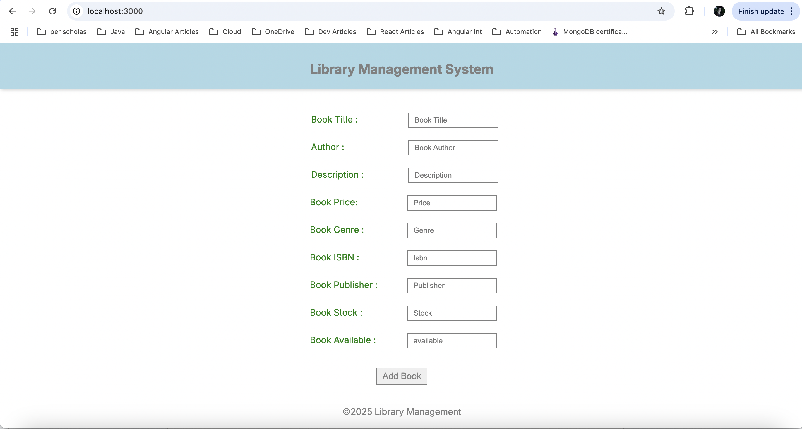
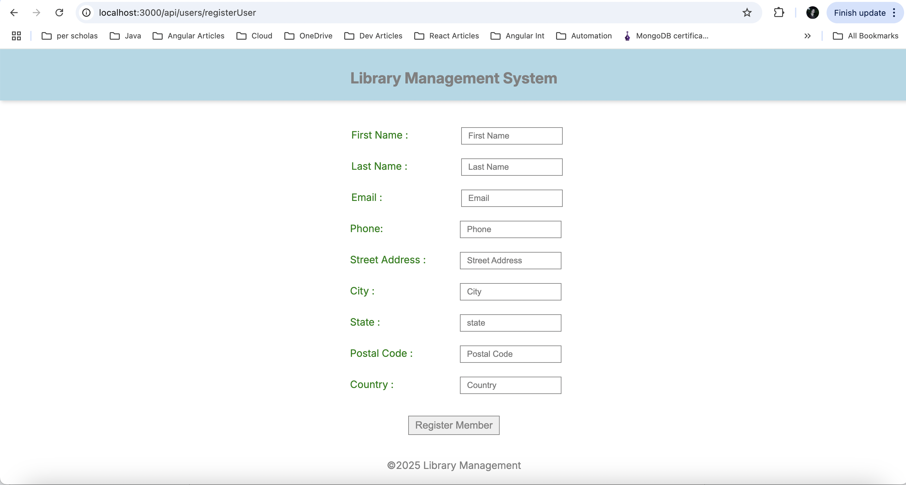
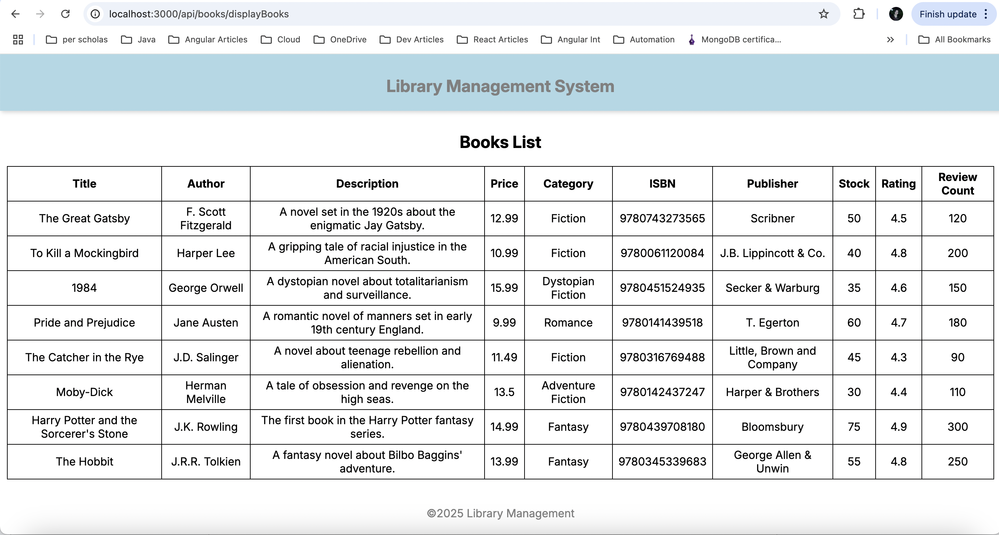
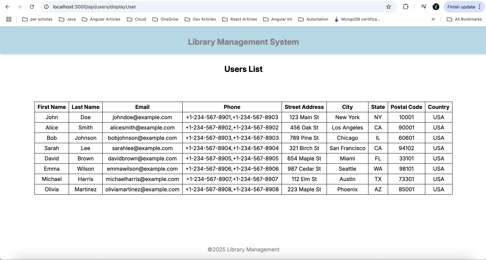
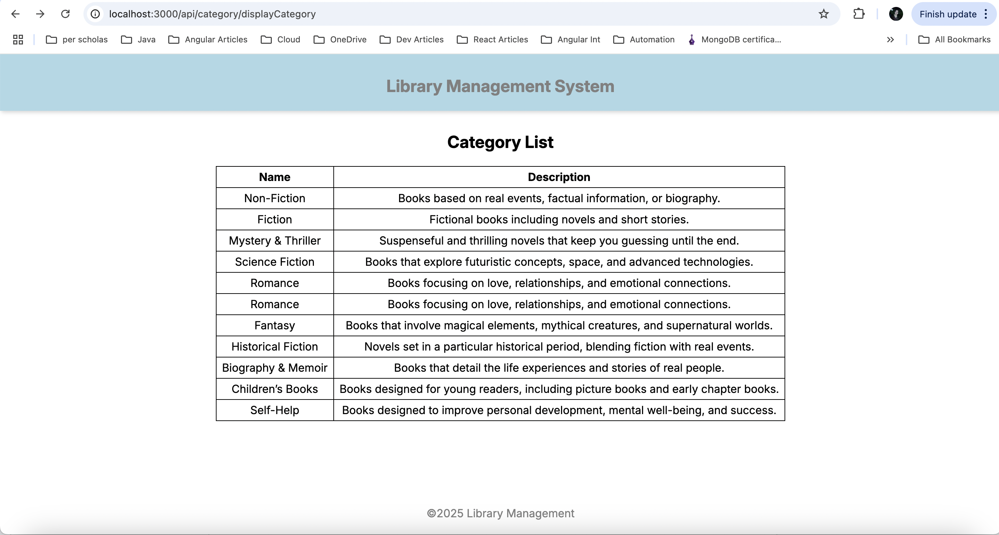

# SBA 318: Express Server Application

## Objectives

- Create a server application with Node and Express.
- Create a RESTful API using Express.
- Create Express middleware.
- Use Express middleware.
- Use a template engine to render views with Express.
- Interact with a self-made API through HTML forms.

## Technologies Used

- HTML
- CSS
- Express

## Features

- Library Management consist of three apis books, category of books and user api.
- Implemented get,post,put,patch and delete api for each of them.
- Implemented Custom logging and logging it to a file as well as error logging to a file.
- Used third party package Morgan for logging.
- implemented query as well as route parameter handling.
- Implemented EJS as view engine to display template, rendered list of books,users and category via template.
- Implemented forms in ejs for post request handling to add book as well as register user.
- Implemented multer third party package to upload file.

## Output

- Rendered frontend through EJS template

